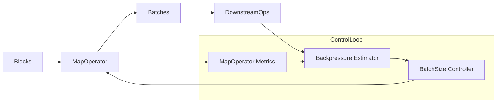

## 1. 执行摘要

**Ray Data 目前不具备类似 Daft 的动态批处理能力**。批处理大小是静态配置的，在算子初始化时确定，无法在运行时根据执行性能动态调整。然而，Ray Data 的架构**具备实现动态批处理的基础设施**，需要添加相应的组件和逻辑。

## 2. 当前状态分析

### 2.1 批处理大小配置方式

Ray Data 中的批处理大小通过 `map_batches()` 的 `batch_size` 参数静态指定：

```
dataset.map_batches(fn, batch_size=256)  # 固定值，无法动态调整
```

关键代码位置：

- `python/ray/data/dataset.py:479-498` - `map_batches()` API
- `python/ray/data/_internal/logical/operators/map_operator.py:168-205` - `MapBatches` 逻辑算子
- `python/ray/data/_internal/execution/operators/map_transformer.py:320-367` - `BatchMapTransformFn` 实现

### 2.2 批处理执行流程

当前批处理流程：

1. **批处理创建阶段**（`Batcher` 类）：

    - `python/ray/data/_internal/batcher.py:50-158` - 静态批处理器
    - 根据预设的 `batch_size` 切分块
    - 不支持运行时修改批处理大小
2. **执行阶段**（`StreamingExecutor`）：

    - `python/ray/data/_internal/execution/streaming_executor.py:442-480` - 调度循环
    - 执行器负责调度任务，但不参与批处理大小的决策
3. **统计收集**（`DatasetStats`）：

    - `python/ray/data/_internal/stats.py:925+` - 统计信息收集
    - 收集执行时间、内存使用等指标
    - **但这些统计信息仅用于监控和报告，不用于动态调整**

### 2.3 与 Daft 动态批处理的对比

| 组件 | Daft                          | Ray Data (当前)                |
| ------ | ------------------------------- | -------------------------------- |
| **批处理大小配置**     | 动态，运行时调整              | 静态，初始化时确定             |
| **执行统计跟踪**     | Worker 记录批次大小和执行时间 | 有统计收集，但不用于批处理调整 |
| **批处理管理器**     | `BatchManager`分析统计并计算新大小          | ❌ 不存在                      |
| **Buffer 动态更新**     | `update_bounds()`支持运行时修改                | ❌`Batcher`不支持动态更新               |
| **Dispatcher 协调**     | 每次批次后重新计算并更新      | ❌ 调度器不参与批处理决策      |
| **延迟约束优化**     | 二分搜索算法优化批处理大小    | ❌ 无优化算法                  |

## 3. 实现可行性评估

### 3.1 ✅ 已具备的基础设施

1. **执行统计系统**：

    - `DatasetStats` 和 `BlockExecStats` 已收集执行时间、内存使用等指标
    - 位置：`python/ray/data/_internal/stats.py`
2. **流式执行架构**：

    - `StreamingExecutor` 提供调度循环，可以集成动态调整逻辑
    - 位置：`python/ray/data/_internal/execution/streaming_executor.py`
3. **批处理基础设施**：

    - `Batcher` 类处理批处理逻辑
    - `BatchIterator` 管理批处理迭代
    - 位置：`python/ray/data/_internal/batcher.py` 和 `python/ray/data/_internal/block_batching/iter_batches.py`
4. **算子架构**：

    - `MapOperator` 和 `BatchMapTransformFn` 提供清晰的扩展点
    - 位置：`python/ray/data/_internal/execution/operators/map_operator.py`

### 3.2 ❌ 缺失的组件

要实现动态批处理，需要添加以下组件：

1. **动态批处理管理器**（类似 Daft 的 `BatchManager`）：

    - 收集 Worker 的执行统计（批次大小、执行时间）
    - 实现延迟约束优化算法（如二分搜索）
    - 计算新的批处理大小上下界
2. **可动态更新的 Batcher**：

    - 扩展 `Batcher` 类，添加 `update_bounds(lower_bound, upper_bound)` 方法
    - 支持运行时修改批处理大小范围
3. **执行统计反馈机制**：

    - 在 `MapOperator` 或 `BatchMapTransformFn` 中记录每个批次的执行统计
    - 将统计信息传递给批处理管理器
4. **调度器集成**：

    - 在 `StreamingExecutor` 的调度循环中集成批处理大小调整逻辑
    - 每次批次完成后触发重新计算

## 4. 实现路径建议

### 4.1 阶段 1：核心组件开发

1. **创建** **`DynamicBatchManager`** **类**：

    ```
    class DynamicBatchManager:
        def __init__(self, initial_batch_size, target_latency_s=5.0):
            self.batch_size_range = (1, initial_batch_size * 4)
            self.target_latency_s = target_latency_s
            self.execution_stats = []

        def record_execution_stats(self, batch_size, duration_s):
            """记录批次执行统计"""
            self.execution_stats.append((batch_size, duration_s))

        def calculate_batch_size(self) -> Tuple[int, int]:
            """计算新的批处理大小范围"""
            # 实现延迟约束的二分搜索算法
            # 返回 (lower_bound, upper_bound)
    ```
2. **扩展** **`Batcher`** **类**：

    ```
    class DynamicBatcher(Batcher):
        def update_bounds(self, lower_bound: int, upper_bound: int):
            """运行时更新批处理大小范围"""
            self._batch_size = (lower_bound + upper_bound) // 2
            self._lower_bound = lower_bound
            self._upper_bound = upper_bound
    ```

### 4.2 阶段 2：执行统计集成

1. **在** **`BatchMapTransformFn`** **中记录统计**：

    - 在执行前后记录时间戳
    - 记录批次大小
    - 将统计传递给 `DynamicBatchManager`
2. **在** **`MapOperator`** **中集成管理器**：

    - 为每个算子创建独立的 `DynamicBatchManager` 实例
    - 在执行循环中调用统计记录和大小调整

### 4.3 阶段 3：调度器集成

1. **在** **`StreamingExecutor`** **中集成**：

    - 在调度循环中检查是否需要调整批处理大小
    - 调用 `DynamicBatchManager.calculate_batch_size()`
    - 更新对应算子的 `Batcher` 边界

### 4.4 阶段 4：API 扩展

1. **扩展** **`map_batches()`**  **API**：

    ```
    dataset.map_batches(
        fn,
        batch_size=256,  # 初始值或范围
        enable_dynamic_batching=True,  # 新参数
        target_latency_s=5.0,  # 延迟目标
    )
    ```

## 5. 技术挑战

1. **分布式环境下的统计收集**：

    - Ray Data 在分布式环境中运行，需要跨节点的统计聚合机制
    - 可能需要使用 Ray 的分布式状态管理
2. **算子独立性**：

    - 每个算子应维护独立的动态批处理状态
    - 需要确保不同算子的调整不会相互干扰
3. **反压机制协调**：

    - 动态批处理需要与现有的反压（backpressure）机制协调
    - 确保不会造成资源争用
4. **向后兼容性**：

    - 需要保持现有 API 的兼容性
    - 动态批处理应作为可选功能

## 6. 参考实现

Ray Serve 中已有类似的动态批处理实现：

- `python/ray/serve/batching.py:828-835` - `batch()` 装饰器
- 使用 `max_batch_size` 和 `batch_wait_timeout_s` 参数
- 可以作为参考，但 Ray Serve 的场景（请求服务）与 Ray Data（批量处理）有所不同

## 7. 结论

**Ray Data 目前无法实现动态批处理**，但**架构上具备实现的基础**。主要工作包括：

1. ✅ **基础设施完备**：执行统计、流式执行、批处理基础设施都已存在
2. ❌ **核心组件缺失**：需要开发动态批处理管理器、可更新的 Batcher、统计反馈机制
3. 🔧 **实现复杂度**：中等，需要深入理解 Ray Data 的执行模型和调度机制
4. ⏱️ **开发工作量**：估计需要 2-3 个月的开发时间（包括测试和文档）

**建议**：如果需要在 Ray Data 中实现动态批处理，可以参考 Daft 的实现思路，结合 Ray Data 的架构特点进行适配。这是一个有价值的特性，可以显著改善 AI 工作负载的用户体验。

## 8. 已实现进展与下一步优化方向

### 8.1 已落地的初版实现（本分支）

在当前分支中，我们已经基于上述设计，落地了一个 **每任务内局部自适应** 的动态批处理初版，主要特性包括：

- 在 `map_batches()` API 中新增：
  - `enable_dynamic_batching: bool = False`
  - `target_latency_s: float = 5.0`
- 逻辑 / 物理链路打通：
  - `Dataset.map_batches -> MapBatches 逻辑算子 -> BatchMapTransformFn -> batch_blocks -> blocks_to_batches`
- 核心组件：
  - `DynamicBatchManager`：滑动窗口统计 `(batch_size, duration_s)`，围绕目标延迟 `target_latency_s` 调整 `(lower_bound, upper_bound)`。
  - `DynamicBatcher`：继承 `Batcher`，通过 `update_bounds()` 动态更新内部 `_batch_size`。
  - `_DynamicBatchingIterator`：在每次产出 batch 时计时、上报给 `DynamicBatchManager`，并驱动 `DynamicBatcher` 更新批大小。
- 约束：
  - 仅支持 **per-task 本地自适应**，不做跨 worker 全局协调。
  - 与 local shuffle（`shuffle_buffer_min_size` / `local_shuffle_buffer_size`）互斥。
  - 启用动态批处理时必须显式指定 `batch_size` 作为初始值。

### 8.2 下一步潜在优化方向

1. **更智能/稳定的 batch size 调整策略**

   - 目前策略是基于平均延迟的简单「涨/跌」控制，可以进一步：
     - 引入 **PID 控制 / 指数加权滑动平均（EWMA）**，减少抖动。
     - 支持按 **P95/P99 延迟** 而非均值进行决策，更贴近尾延迟约束。
     - 提供多种策略（吞吐优先 / 延迟优先 / 混合），通过 `DataContext` 或 `map_batches` 参数选择。

2. **与 StreamingExecutor / 资源管理更紧耦合**

   - 当前调整发生在单个 `MapOperator` 任务内部，对全局调度不可见。进一步可以：
     - 在 `StreamingExecutor` 中暴露钩子，将算子级统计（平均 batch 延迟、当前 batch_size 区间）纳入 **backpressure / 资源分配决策**。
     - 当下游出现反压时，动态减小上游批大小，避免大批次造成内存放大和队列堆积。

3. **跨 worker 的全局批大小协调**

   - 目前同一个 `map_batches` 在不同 worker 上各自调整，可能导致批大小分布不均。可以探索：
     - 使用 Ray 的 `Actor` / `internal_kv` 维护一个 **轻量级全局控制器**，周期性聚合各 worker 的统计，广播推荐的全局 `(lower, upper)`。
     - 设计收敛和容错策略（如控制刷新频率、避免单 worker outlier 干扰整体）。

4. **更丰富的 API 与自动调参体验**

   - 在 API 层面可以增加：
     - `min_batch_size` / `max_batch_size` 参数，限制动态范围，防止过小/过大。
     - 针对 GPU 推理场景的预设配置，如 `mode="gpu_inference"` 自动选择默认 `target_latency_s` 和范围。
   - 支持通过 `DataContext` 设置全局默认策略，例如：
     - `DataContext.get_current().dynamic_batching.enabled = True`
     - 统一管理延迟目标和全局上下限。

5. **与迭代接口 / 其它算子联动**

   - 当前仅在 `map_batches` 路径上启用，后续可以考虑：
     - 支持 `iter_batches()` 的动态批处理（尤其是训练/评估循环场景）。
     - 探索与 `StreamingRepartition`、`RandomShuffle` 等 all-to-all 算子融合时，如何根据下游算子代价去反向调整上游批大小。

6. **可观测性与调试工具**

   - 增加统计输出，方便在 Dashboard / 日志中观察动态批调整行为，例如：
     - 每个 `MapBatches` 的当前 batch_size 区间、实际采样点、平均延迟。
     - 将这些信息集成到 `DatasetStats` 或 debug 日志中。
   - 提供开关参数（如 `debug_dynamic_batching=True`）输出详细决策过程，方便线上调优和问题定位。

7. **更系统的压测与 benchmark**

- 构造标准基准场景：
  - CPU / GPU 推理（轻量 / 重模型）
  - I/O 受限 vs 计算受限
- 比较静态 batch_size、简单动态策略、增强策略（PID/全局协调）在：
  - 吞吐（rows/s）、
  - 平均延迟 / P95 延迟、
  - 内存占用 / OOM 风险
- 形成文档化的建议：在什么 workload 下推荐开启动态批处理，以及推荐的参数区间。

## 9. 深度设计：与 StreamingExecutor / 资源管理 & 全局协调的集成

本章在第 8 章的高层想法基础上，进一步细化了两条关键演进路径的设计草案：  
（1）**与 StreamingExecutor / 资源管理更紧耦合**；（2）**跨 worker 的全局批大小协调**。

### 9.1 与 StreamingExecutor / 资源管理更紧耦合

#### 9.1.1 设计目标

- 将当前只在单个 `MapOperator` 任务内部可见的动态批信息（平均 batch 延迟、当前 batch_size 区间）提升到 **执行拓扑 / 资源管理层级**。
- 在存在 **下游反压 / 内存压力** 时，自动驱动上游算子减小批大小，避免单批过大导致：
  - 下游队列堆积；
  - 内存峰值过高（尤其是 GPU 内存或对象存储）。

#### 9.1.2 需要暴露的算子级指标

在 `MapOperator` 中补充对以下指标的聚合和暴露（可挂在 `op.metrics` 或 `op.get_stats()`）：

- **批处理时延指标**（按算子聚合）：
  - `avg_batch_build_latency_s`：从 block 到 batch 的平均构建时间（可由 `_DynamicBatchingIterator` 提供）。
  - `p95_batch_build_latency_s`（可选）：用于更准确反映尾延迟。
- **批尺寸指标**：
  - `current_batch_size_lower_bound` / `current_batch_size_upper_bound`。
  - `current_effective_batch_size`（即 DynamicBatcher 当前使用的中值）。
- **队列 / 反压相关指标**（已有部分，可复用）：
  - `input_queue_num_blocks` / `output_queue_num_blocks`。
  - `input_queue_bytes` / `output_queue_bytes`。

这些指标应通过 `MapOperator.get_stats()` 汇总进 `DatasetStats`，同时在内部暴露给 `StreamingExecutor`。

#### 9.1.3 StreamingExecutor 侧的钩子设计

在 `StreamingExecutor._scheduling_loop_step()` 或其调用链中，加入 **动态批控制策略模块**，其伪代码大致如下：

```python
def _maybe_adjust_dynamic_batching(topology, resource_manager):
    for op in topology.operators:
        if not isinstance(op, MapOperator):
            continue
        if not op.supports_dynamic_batching:
            continue

        metrics = op.metrics  # 包含队列长度、内存使用、batch 延迟等
        down_pressure = _estimate_downstream_backpressure(op, topology, resource_manager)

        if down_pressure.is_high():
            op.decrease_batch_size(reason="downstream_backpressure")
        elif down_pressure.is_low() and metrics.batch_latency_below_target():
            op.increase_batch_size(reason="underutilized")
```

关键点：

- **反压检测**：可基于现有 backpressure policy（`downstream_capacity_backpressure_policy` 等），结合下游队列长度、`output_budget_bytes`、任务完成速度评估 `down_pressure`。
- **算子级 API**：
  - 在 `MapOperator` 上增加诸如：
    - `supports_dynamic_batching: bool`（由 `MapBatches` / `BatchMapTransformFn` 决定）。
    - `increase_batch_size()` / `decrease_batch_size()`，内部通过调用绑定的 `DynamicBatchManager` 接口（或向 worker 侧发 signal）。
- **节流 / 抖动控制**：
  - 每个算子维护 `last_adjust_time`，限制调整频率（例如 ≥ 1s 才允许调整一次）。
  - 每次调整的比例控制在小步（例如 ±10%-20%），避免频繁振荡。

#### 9.1.4 控制流与数据流关系

可以将其抽象为一个控制回路：



- **数据流**：`Blocks -> MapOperator -> Batches -> 下游算子` 不变。
- **控制流**：`MapOperator + 下游算子` 产生的指标通过 `Backpressure Estimator` 评估，交给 `BatchSize Controller`，再通过控制接口回写到 `MapOperator` / worker 侧的 `DynamicBatchManager`。

### 9.2 跨 worker 的全局批大小协调

#### 9.2.1 设计目标

- 为同一个 `map_batches` 实例在不同 worker 上提供一个 **全局参考 batch 区间**，避免：
  - 某些 worker 由于数据或硬件差异调整到极小批量，而其他 worker 仍然保持极大批量，造成整体行为不稳定。
- 仍然允许每个 worker 在全局参考区间内做细粒度本地自适应。

#### 9.2.2 组件概览

1. **全局控制器 Actor（GlobalDynamicBatchController）**
   - 以 `dataset_id + op_id` 为 key 创建（或复用）一个 Ray Actor。
   - 对外暴露接口：
     - `report_stats(worker_id, local_bounds, local_latency_stats)`。
     - `get_global_bounds() -> (lower, upper)`。
2. **worker 侧集成**
   - 每个 `MapOperator` / `DynamicBatchManager` 在本地周期性地：
     - 向全局控制器上报本地统计；
     - 拉取新的 `(global_lower, global_upper)` 作为 hard bound，再在内部做局部调整。

#### 9.2.3 全局控制器的聚合与决策策略

聚合逻辑可以设计为 **鲁棒统计 + 限制调节频率**：

- 状态：
  - `per_worker_bounds[worker_id] = (lower, upper)`。
  - `per_worker_latency[worker_id] = {...}`（例如平均延迟 / P95 延迟）。
  - 当前全局区间 `(global_lower, global_upper)`。
- 聚合算法（周期性触发，或在收到足够多上报后触发）：
  1. 收集所有 worker 的 `lower` 与 `upper`：
     - `candidate_lowers = [lower_i]`，`candidate_uppers = [upper_i]`。
  2. 使用中位数或去掉 top/bottom x% 的方式计算：
     - `new_global_lower = median(candidate_lowers)`。
     - `new_global_upper = median(candidate_uppers)`。
  3. 根据整体延迟水平微调：
     - 若大部分 worker 的延迟都 **高于目标**，则整体缩小区间（乘以一个 `shrink_factor`），反之放宽。
  4. 对新全局区间做平滑：
     - `global_lower = alpha * new_global_lower + (1-alpha) * global_lower_old`。
     - `global_upper = alpha * new_global_upper + (1-alpha) * global_upper_old`。
  5. 施加硬限制：
     - 全局 `min_batch_size` / `max_batch_size`。
     - 确保 `global_upper >= global_lower`。

#### 9.2.4 worker 侧如何使用全局区间

在 worker 内部的 `DynamicBatchManager` 增加一个「全局约束」层：

- 本地算法仍然根据样本更新一个 **本地区间** `(local_lower, local_upper)`。
- 实际生效区间：

```text
effective_lower = max(local_lower, global_lower)
effective_upper = min(local_upper, global_upper)
```

- 当拉取到新的全局区间时，`DynamicBatchManager` 更新其上限/下限，然后再重新计算当前 batch_size（仍然可用区间中点或其它策略）。

#### 9.2.5 收敛性与容错考虑

- **控制刷新频率**：
  - worker 上报 / 拉取间隔可以在数百毫秒到数秒之间（例如 1–5s），避免频繁 RPC。
  - 全局控制器内部也可以设置最小调整间隔（如 2s），确保 global 区间不会抖得太快。
- **outlier 防护**：
  - 聚合时使用 **中位数或 trimmed mean**，对极端慢 / 快的 worker 进行降权。
  - 可设置「异常 worker」阈值，如其延迟长期远高于其他 worker，则只让它本地缩小，而不影响全局。
- **容错**：
  - 使用 Ray Actor 的 `get_if_exists`/重启策略；即使全局控制器暂时不可用，worker 仍可在本地区间内继续工作。
  - 可以在 `internal_kv` 中冗余存储最近一次的全局区间，供新 worker 启动时快速预热。
